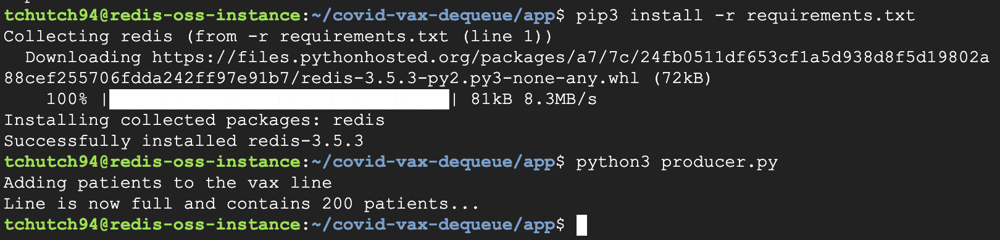
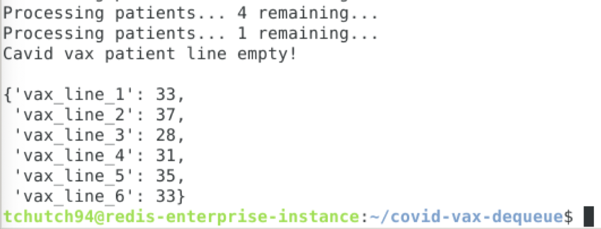

# Covid Vax Dequeue

This app assumes you have a redis server running with a populated list of "patients" on the key: `patients:covid-vaccine`. If you don't, I have included a `producer.py` script that you can run (make sure to set environment variables for your redis connection details).

## Running Env

Pip:
```bash
pip3 install -r requirements.txt
```

Env Vars:
```bash
export REDIS_HOST=''
export REDIS_PORT=''
export REDIS_PASSWORD=''
```

## Producer
Execute the producer script on Server A. This will populate the queue with 200 patients.

```bash
python3 producer.py
```



## Consumer
Execute the consumer script on Server B. This will dequeue patients from the replica Redis instance into 6 recieving lines.


At the end, it will spit out a tracker containing the counts of patients recieved by each serving line like below:



Enjoy!